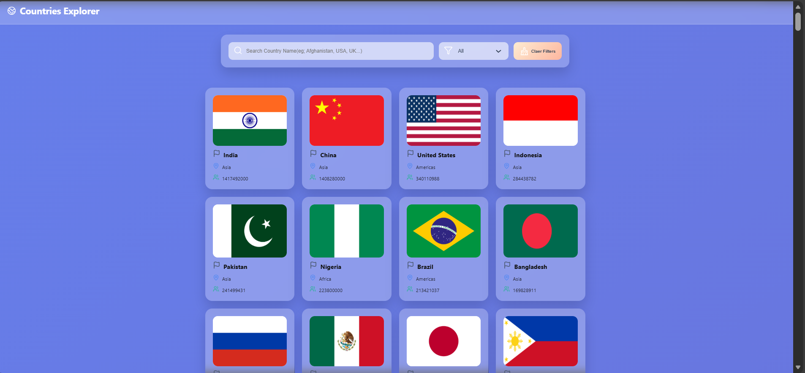
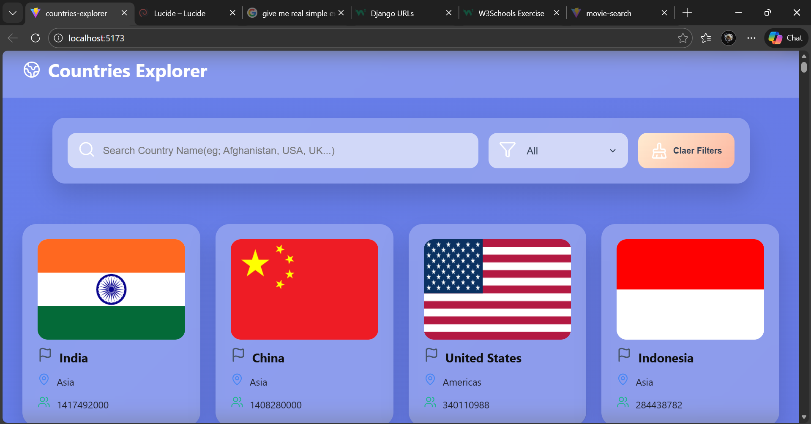
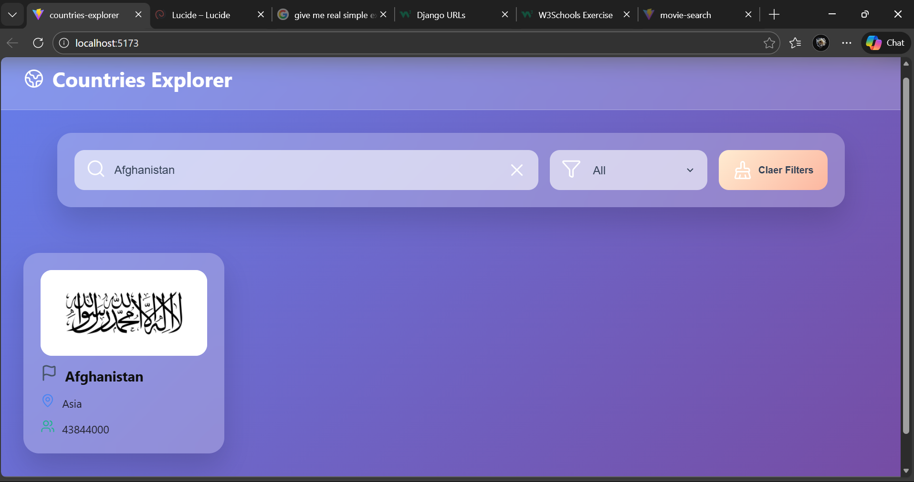
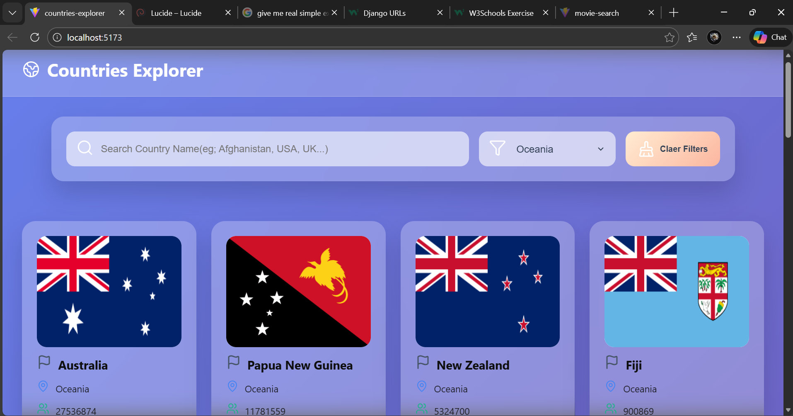
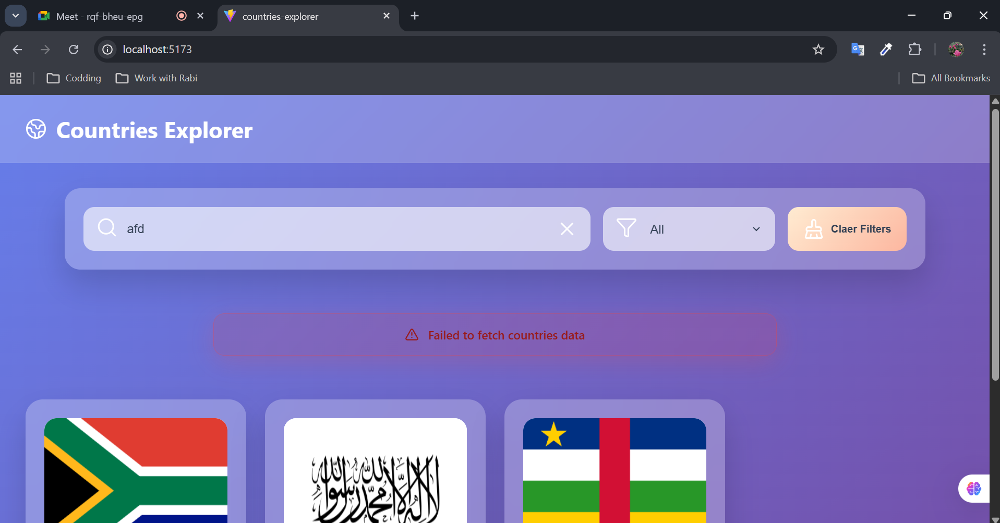
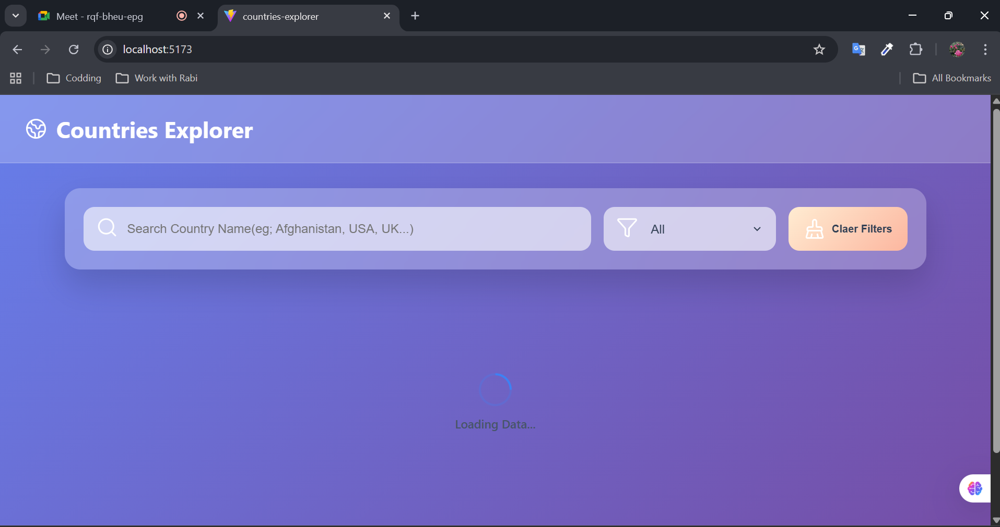

# React-Week-Three-Assignment-countries-explorer

Countries Explorer built with React, featuring real-time search, region filtering, and API data handling.

# 🌍 Countries Explorer

Countries Explorer is a React application that allows users to browse and explore countries around the world using real data from the REST Countries API.

The app supports searching countries by name, filtering by region, and properly handles loading and error states.

---

## 🚀 Features

- Load real country data from an external API
- Search countries by name
- Filter countries by region
- Display country details:
  - Flag
  - Country name
  - Region
  - Population
- Loading and error handling
- No results found message
- Clear filters button
- Sort countries based on population

---

## 🛠️ Technologies Used

- React (useState, useEffect)
- JavaScript (ES6)
- REST Countries API
- CSS for basic styling

---

## 🌐 API Endpoints Used

- All countries:  
  https://restcountries.com/v3.1/all?fields=cca3,name,region,population,flags
- Search by country name:  
  https://restcountries.com/v3.1/name/{name}

- Filter by region:  
  https://restcountries.com/v3.1/region/{region}

---

## ▶️ How to Run the Project

1. Clone the repository:
   ```bash
    git clone <https://github.com/maryam-arif-dev/countries-explorer>
   ```
2. Go to the project directory:
   cd countries-explorer
3. Install dependencies:
   npm install
4. Start the app:
   npm run dev
5. Open in browser:
   http://localhost:5173

## 📁 Project Structure

src/
├── components/
│ ├── Header.jsx
│ ├── SearchFilterSection.jsx
│ ├── CountriesCardsSection.jsx
│ ├── LoadingSection.jsx
│ ├── ErrorSection.jsx
│ └── Footer.jsx
├── App.jsx
├── App.css
└── main.jsx

## 📸 Screenshots

Home Page


Search | Based on Country name

Filter Results | Based on Region

Error

Loading

